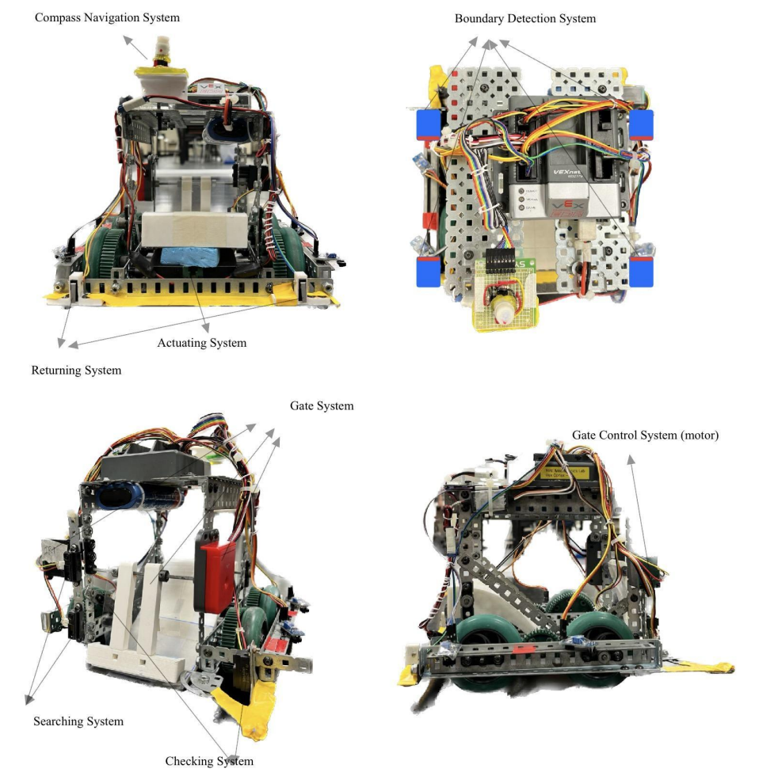

# Autonomous Tennis Ball Fetcher
This project is an autonomous vehicle designed to efficiently search, collect, and deliver tennis balls within a competitive arena. The vehicle integrates mechatronic systems, including robust mechanical design, precise sensors, and optimized control algorithms. The robot's primary features include autonomous ball detection using sharp distance sensors, obstacle avoidance, and boundary adherence via line-tracking modules. The ball collection mechanism employs a swing gate system, and a ramp facilitates seamless ball delivery. The project showcases the full engineering design lifecycle—from conceptualization and prototyping to testing and competition performance. It reflects the team's commitment to simplicity, clarity, and safety in autonomous system design.
See [report](figure/report_atbf.pdf) for details.

|  |  |
| ------------------------- | ------------------------ |

# Software Features and Runtime Environment
**Autonomous Search and Detection:** The robot uses Sharp distance sensors and IR line-tracking modules to detect tennis balls, arena boundaries, and obstacles.

**Path Planning and Navigation:** Implements strategies for autonomous navigation in the arena, including ball search, boundary avoidance, and opponent detection.

**Ball Collection and Delivery Control:** A swing gate controlled by limit switches and servo motors ensures precise ball collection and delivery.

**Hardware Platform:** Combines Arduino Mega and VEX Microcontroller for controlling sensors, actuators, and motors.

# Hardware Design

The hardware design of the autonomous tennis ball collector focuses on creating a compact, robust, and efficient robot within a 30cm x 30cm x 30cm size constraint. The chassis is built using a hollow metal frame for stability and durability, with wheels, motors, and gears enclosed to protect against collisions. A differential drive system powered by two motors provides synchronized speed and torque, ensuring precise maneuverability. The ball collection mechanism features a modular 3D-printed swing gate for capturing and delivering balls, complemented by a lightweight ramp with smooth curvature for efficient ball handling. The robot is equipped with Sharp distance sensors for object detection, IR line-tracking modules for boundary adherence, a digital compass for orientation, and limit switches for mechanism control. Powered by a 7.2V rechargeable NiMH battery, the design prioritizes energy efficiency and safety, with insulated connections and protected components. The modular design ensures easy assembly, maintenance, and adaptability for competition scenarios.
